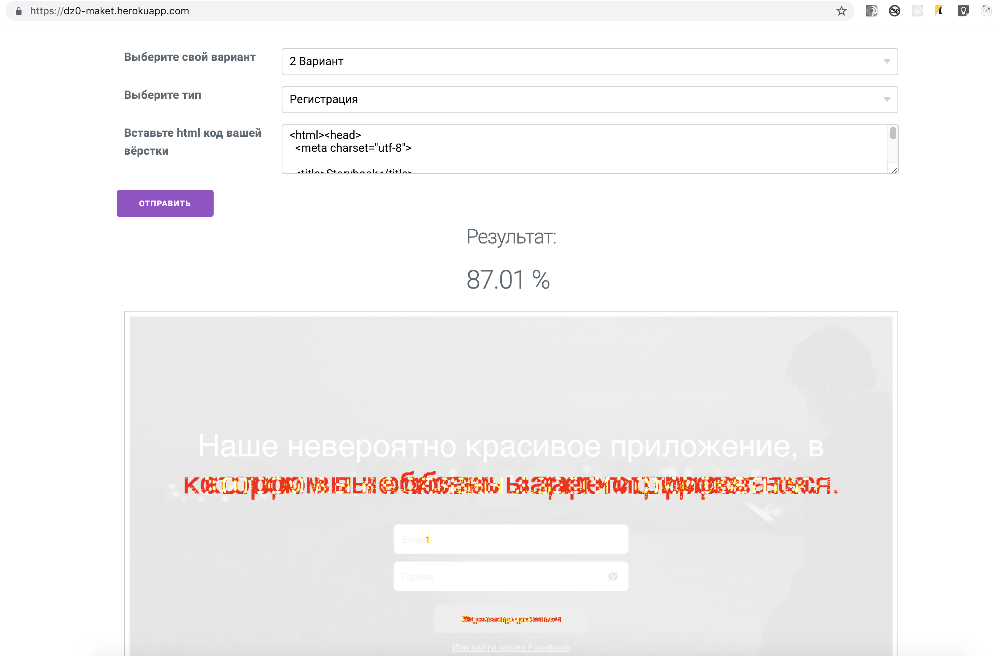

# Домашнее задание №0-2

## Привет!

В этом репозитории содержится условие всех вариантов второго нулевого домашнего задания. Чтобы начать с ним работать, **тебе необходимо склонировать репозиторий к себе на компьютер и перейти в ветку твоего варианта**.

Это домашнее задание преследует несколько целей:
- во-первых, оно позволяет вам попрактиковаться в использовании различных возможностей CSS;
- во-вторых, макеты, которые вы реализуете в этом домашнем задании, можно будет использовать (целиком или частично) в качестве составных частей вашего семестрового проекта.

### Условие

Необходимо сверстать 5 макетов. Макеты представлены в папке `references` (в ветке с вариантом) в виде `.png` изображений.

### Оценки

Задание оценивается в **5 баллов**. Будет оцениваться качество вёрстки каждого макета. Мы хотим видеть лаконичный и семантический HTML и умелое использование CSS. За выполнение следующих условий в этом задании можно получить дополнительные баллы:
* \+ 1 за современный CSS
* \+ 1 за адаптивность
* \+ 1 за кроссбраузерность
* \+ 1 за пиксель-пёрфект

### Тестирующая система

Во время выполнения ДЗ, вы можете пользоваться тестирующей системой, доступной по [ссылке](https://dz0-maket.herokuapp.com/). Там вам необходимо выбрать ваш вариант, тип макета и вставить ваш `html` (это важный нюанс, поскольку в репозитории вы можете хранить ваши стили в отдельных `css` файлах, но перед отправкой в тестирующую систему вам нужно будет вставить их содержимое в тег `style` в `html`).

Как это выглядит:

Сервер периодически перезапускается, поэтому иногда может быть недоступен в течении пары минут. Будьте терпеливы  :)

#### Напутствия:
* В шрифтах указывайте `Helvetica, Arial, san-serif`. Даже если у вас, нет в системе `Helvetica` в тестирующей системе он есть;
* Не переопределяйте стандартные отступы у тегов `body` и `html`;
* Все отступы между элементами кратны 4. Паддинги кратны 5. Если обнаружите, что где-то это не так, просьба сообщить преподавателям;
* Цель ДЗ &mdash; проверить ваши навыки и уменя в вёрстке. Поэтому в первую очередь вам нужно постараться написать красивый и выразительный код, а уже потом &mdash; достичь пиксель-пёрфект сходства вашей вёрстки с макетом.

#### Используемые в макетах ресурсы:
* Все используемые иконки из макетов можно получить по [ссылке](https://cloud.mail.ru/public/61Z5/bG8vDmKfo);
* Флажки [России](https://img.imgsmail.ru/mail/ru/images/country_icons/ru.png) и [Украины](https://img.imgsmail.ru/mail/ru/images/country_icons/ua.png);
* Лого [Mail.Ru](https://img.imgsmail.ru/static.promo/logo/logo.svg);
* Фон у одного из макетов [тут](https://www.scdn.co/i/generic/hero-lg.jpg).
